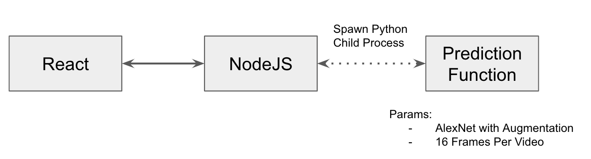
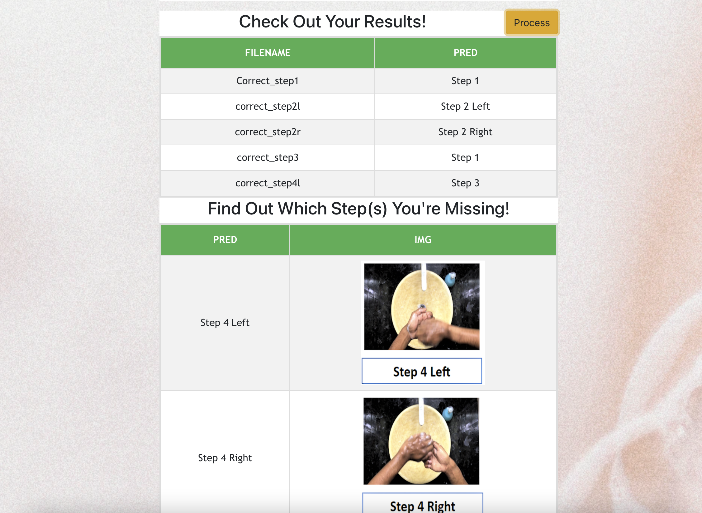

# Handwash Deep Learning Big Project - UI

## Abstract
Due to the recent COVID-19 outbreak, handwashing with soap can be one of the defenses against the virus. By practising hand hygiene, it can be used to protect us from these diseases, as such the practice of handwashing at regular intervals should be encouraged and promoted. With the seven-step hand washing technique (broken down into 12 actions) endorsed by the CDC and World Health Organization (WHO) (Boshell, n.d.), we would like to promote this proper hand washing technique to ensure that the hand washing steps are followed correctly. By using machine learning to identify if the hand washing steps are being followed correctly, users can be notified if they have missed out on some actions.

## Architecture


## Model Information
Download the latest pre-trained Alexnet trained model [here](https://storage.googleapis.com/dl-big-project/alexnet_128.pt) and place into ./machine_learning/model   
For more information regarding the model architecture: [Model Info](https://github.com/huiwen99/HandWash)

## Screenshot



## Installation
Ensure that the pretrained Pytorch Model is in ```./machine_learning/model``` before running, refer to [Model Information](#model-information)
You will need to have the following packages found under [Technologies](#technologies) to run. 

##### Local:
Change directory to handwashUI: ```cd HandWash/handwashUI/``` then install required packages:  ```npm install```. 
Run the server and front end concurrently by: ```npm run dev```

##### Cloud Server:
Tested on AWS EC2 Instance (t2.medium with 16GB Disk Storage on Ubuntu LTS 20.X). 
Note that the API URL axios address calls found in ```App.js``` and ```fileupload.js``` must be changed.


## Demo
[](https://www.youtube.com/watch?v=DLfKYGBf7oE "50.039 : Theory and Practice of Deep Learning_BigProject_Group5_HandWash")


## Technologies
- [React](https://reactjs.org/)
- [NodeJS](https://nodejs.org/en/)
- [PyTorch](https://pytorch.org/)
- [OpenCV](https://opencv.org/)
- [Numpy](https://numpy.org/)
