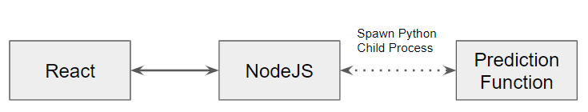

# Handwash Deep Learning Big Project - UI

## Abstract
Due to the recent COVID-19 outbreak, handwashing with soap can be one of the defenses against the virus. By practising hand hygiene, it can be used to protect us from these diseases, as such the practice of handwashing at regular intervals should be encouraged and promoted. With the seven-step hand washing technique (broken down into 12 actions) endorsed by the CDC and World Health Organization (WHO) (Boshell, n.d.), we would like to promote this proper hand washing technique to ensure that the hand washing steps are followed correctly. By using machine learning to identify if the hand washing steps are being followed correctly, users can be notified if they have missed out on some actions.

## Architecture


## Model Information
Please visit [Model Info](https://github.com/huiwen99/HandWash)

## Screenshot


## Technologies
- [React](https://reactjs.org/)
- [NodeJS](https://nodejs.org/en/)
- [PyTorch](https://pytorch.org/)
- [OpenCV](https://opencv.org/)
- [Numpy](https://numpy.org/)

## Installation
Either run it locally or on an AWS EC2 Instance (XLarge with 32GB Disk Storage on Ubuntu LTS 20.X). You will need to have the following packages found under Technologies to run. Note that the API URL address calls found in ```App.js``` and ```fileupload.js``` must be changed if running on a cloud server, for running locally, no changes are required. Ensure that there is a root folder called ```uploads``` before uploading any files.

## Demo
[](https://www.youtube.com/watch?v=DLfKYGBf7oE "50.039 : Theory and Practice of Deep Learning_BigProject_Group5_HandWash")


```npm install```
```npm run dev```
